### Задание для Java developer

Создайте веб Java-приложение, которое позволяет
работать с карточками товара в интернет-магазине
Создайте БД с информацией о товарах. Заполните
начальными тестовыми данными. В базе данных
должно содержаться следующая информация о товарах:

- Название товара
- Бренд
- Модель
- Количество доступных единиц
- Вес
- Рейтинг
- Категория товара
- Описание
- Цвет
- Цена
- Название фото
- Фото
- Особенности (список)
  В приложении должно быть:

1. CRUD для Продуктов. URl: `/api/products` (см.
   Пример Json запроса)
    1. При создании либо изменении в БД должно
       изменяться поле `Описание`, оно должно
       содержать краткое описание, касающееся
       товара со всех основных полей БД, например
       >Прекрасные наушники Acme, цвет: черный.
       Активное шумоподавление, Складной дизайн,
       Встроенный микрофон.»
2. Функционал по обработке 1 фото (выберите фото с
   фоном на ваш выбор, исходник сохраните, в
   resources). При загрузке фото должен
   происходить запрос к
   API(https://www.remove.bg/api) с
   исходной фотографией для удаления фона с
   изображения. Измененное фото cохранить (место
   на
   выбор исполнителя задания), добавить
   обработанное фото в соответствующее поле в
   карточку
   товара.

### Пример Json запроса:
```json
{
  "product": {
    "name": "Прекрасные наушники",
    "description": "Стерео наушники с шумоподавлением",
    "price": 49.99,
    "color": "черный",
    "brand": "Acme",
    "category": "Электроника",
    "availability": true,
    "rating": 4.5,
    "image_url": "https://example.com/images/headphones.jpg",
    "weight": "200 г",
    "warranty": "2 года",
    "special_features": [
      "Активное шумоподавление",
      "Складной дизайн",
      "Встроенный микрофон"
    ]
  }
}
```

### Технические требования:
Использованные исходные фото приложите в проект в /resources
- Gradle
- Spring Boot 3.2.5
- Java 17+
- Packaging Jar
- БД H2 или SQLite
- Добавить логи
Доп. Задания (необязательно):
1. Запрос для получения карточки товара с наивысшим рейтингом.
2. Запрос для получения карточки самого дорогого/дешевого товара.
3. Добавить возможность загружать и хранить несколько фотографий для одного товара.


### Sitemap

```mermaid
---
title: Sitemap
---

flowchart TB
    root{"/(root)"} ---> pct(/api/products)
    root ---> rbg(/api/removeBg)
    pct --> GETpct{{GET}}
    pct --> POSTpct{{POST}}
    pct ---> pctID("/{id}")
    pctID --> GETpctID{{GET}}
    pctID --> PUTpctID{{PUT}}
    pctID --> DELETEpctID{{DELETE}}
    pct --> pctBest(/best) --> GETBestPct{{GET}}
    pct --> pctExp(/cheap) --> GETExpPct{{GET}}
    pct --> pctChe(/expensive) --> GETChePct{{GET}}
    rbg --> POSTrbg{{POST}}
```



### Запуск
```shell

chmod +x ./gradlew &&  ./gradlew && ./gradlew bootRun --remove.bg.token=TOKEN

```